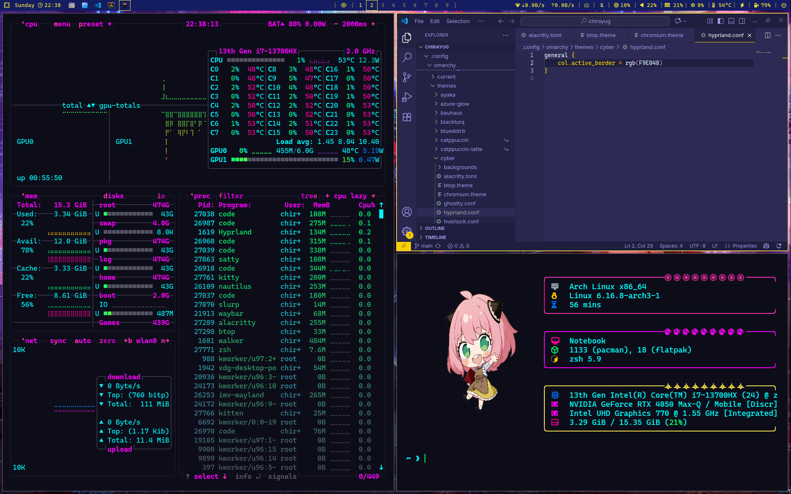

# omarchy-cyberpunky-theme
A cyberpunk-inspired theme for the Omarchy Linux distribution.  Deleted by creator and posted here for posterity.
This theme was created out of a passion for the cyberpunk aesthetic and a desire to customize the Omarchy Hyprland experience. 
It transforms your desktop into a neon-lit, futuristic environment with a cohesive look across all major applications.

# Preview


# Installation
This theme is designed to be installed using Omarchy's built-in theme management tool.

Open a terminal.

Run the following command in your terminal:

```bash
omarchy-theme-install https://github.com/twodogsdave/omarchy-cyberpunky-theme
```

# Note
I do not own the wallpapers and thank the creators of the wallpaper.
